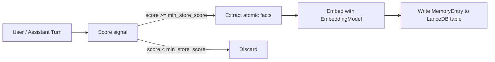
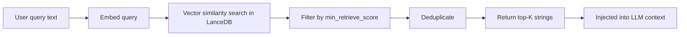

Long-term memory in Logicore is powered by `AgentrySimpleMem` and stored in a LanceDB vector database. Unlike short-term session history, it persists across process restarts and can optionally be shared across multiple sessions.

Enable it by passing `memory=True` to any agent constructor:

```python
from logicore.agents.agent import Agent

agent = Agent(llm="ollama", memory=True)
```

## What Gets Stored

Not every message turn is stored. `AgentrySimpleMem` applies a scoring pipeline to filter out low-signal content before it ever reaches LanceDB.

### Signal scoring

Each dialogue turn is scored using `_score_memory_signal()`. Points are added or subtracted based on pattern matching:

| Signal | Score change |
|---|---|
| Contains durable markers (`my name is`, `I prefer`, `stack`, `framework`, `deadline`, etc.) | +2 |
| References a completed action (`scheduled`, `created`, `saved`, `updated`, `fixed`) | +2 |
| Contains a number or version | +1 |
| Message length in the 5–40 token sweet spot | +1 |
| Is a question | -2 |
| Is vague acknowledgement (`ok`, `thanks`, `sure`, `hi`) | -2 |
| Is a transient reminder request (`remind me in 5 minutes`) | -3 |
| Is a promissory assistant statement (`I'll remind you`) with no confirmation | -2 |

Only turns that score at or above `SIMPLEMEM_MIN_STORE_SCORE` (default: `3`) proceed to fact extraction.

<Tip>
  Adjust the threshold with the `SIMPLEMEM_MIN_STORE_SCORE` environment variable. Lower values store more facts; higher values are more selective.
</Tip>

### Atomic fact extraction

Turns that pass the score threshold are split into atomic facts by `_extract_atomic_facts()`. Each sentence or bullet-point line is evaluated independently. Facts are capped at `SIMPLEMEM_MAX_MEMORY_CHARS` characters (default: 220) and at `SIMPLEMEM_MAX_FACTS_PER_TURN` facts per turn (default: 3).

## Storage Pipeline



### `MemoryEntry` schema

Each stored entry is a `MemoryEntry` dataclass with the following fields:

```python
@dataclass
class MemoryEntry:
    entry_id: str             # UUID
    lossless_restatement: str # The stored fact text (with [Speaker][score=N] prefix)
    keywords: List[str]       # Extracted keywords (stop-words removed)
    timestamp: Optional[str]  # ISO 8601 datetime of when it was queued
    location: Optional[str]
    persons: List[str]        # Speaker name
    entities: List[str]
    topic: Optional[str]
```

The `lossless_restatement` field carries a score tag, for example:

```
[User][score=4] My preferred stack is FastAPI + PostgreSQL
```

This tag is used at retrieval time to filter results by the `SIMPLEMEM_MIN_RETRIEVE_SCORE` threshold.

## Retrieval Pipeline

Retrieval happens at the start of every `agent.chat()` call when memory is enabled.



`AgentrySimpleMem.on_user_message()` handles this and returns a list of relevant memory strings:

```python
contexts: List[str] = await agent.simplemem.on_user_message("What stack do I use?")
# e.g. ["[User][score=4] My preferred stack is FastAPI + PostgreSQL"]
```

Retrieval is **pure embedding search** — no LLM calls are made during retrieval. The target latency is 10–50 ms.

### Retrieval threshold

Only results whose embedded score tag meets `SIMPLEMEM_MIN_RETRIEVE_SCORE` (default: `2`) are returned. This prevents low-confidence facts from polluting the context.

## Persistence Scope

Long-term memory can be scoped in two ways, controlled by the `isolate_by_session` parameter on `AgentrySimpleMem`.

<Tabs>
  <Tab title="Per-session isolation (default)">
    Each `session_id` gets its own LanceDB table:

    ```
    memories_<user_id>_<session_id>
    ```

    This is the default (`isolate_by_session=True`). Facts written in one session are not visible in another session, even for the same user.

    ```python
    # Default behavior — session-isolated tables
    agent = Agent(llm="ollama", memory=True)
    await agent.chat("I use PostgreSQL", session_id="session-1")

    # session-2 cannot retrieve the PostgreSQL fact
    reply = await agent.chat("What DB do I use?", session_id="session-2")
    ```
  </Tab>
  <Tab title="Shared per-user table">
    To share facts across sessions for the same user, override the `simplemem` instance after agent creation:

    ```python
    from logicore.agents.agent import Agent
    from logicore.simplemem import AgentrySimpleMem

    agent = Agent(llm="ollama", memory=True)

    agent.simplemem = AgentrySimpleMem(
        user_id=agent.role,
        session_id="global",
        isolate_by_session=False,  # all sessions share one table: memories_<user>
        debug=True
    )

    # Both sessions read from and write to the same table
    await agent.chat("I prefer dark mode", session_id="session-1")
    reply = await agent.chat("What do I prefer?", session_id="session-2")
    print(reply)  # Can recall the dark mode preference
    ```
  </Tab>
</Tabs>

## Storage Location

LanceDB data is stored locally by default under:

```
logicore/user_data/lancedb_data/
```

In cloud deployments, set `LANCEDB_PATH` to an S3 or Azure Blob path and set `AGENTRY_MODE=cloud`.

## Environment Variables

| Variable | Default | Description |
|---|---|---|
| `AGENTRY_MODE` | `local` | Set to `cloud` to use `LANCEDB_PATH` for remote storage |
| `LANCEDB_PATH` | *(derived)* | Override LanceDB storage path in cloud mode |
| `EMBEDDING_MODEL` | `qwen3-embedding:0.6b` | Ollama embedding model name |
| `OLLAMA_URL` | `http://localhost:11434` | Ollama service URL |
| `SIMPLEMEM_MIN_STORE_SCORE` | `3` | Minimum signal score to persist a fact |
| `SIMPLEMEM_MIN_RETRIEVE_SCORE` | `2` | Minimum score tag to include a fact at retrieval |
| `SIMPLEMEM_MAX_FACTS_PER_TURN` | `3` | Max atomic facts extracted per dialogue turn |
| `SIMPLEMEM_MAX_MEMORY_CHARS` | `220` | Max character length for a single stored fact |
| `SIMPLEMEM_TOP_K` | `5` | Number of results returned by semantic search |

## Memory Flushing

The dialogue queue is processed automatically:

- After the assistant's final response in each `agent.chat()` call
- During agent cleanup

To flush manually:

```python
if agent.simplemem:
    await agent.simplemem.process_pending()
```

<Warning>
  If the process is killed before `process_pending()` runs, any queued but unprocessed dialogue turns will be lost. For critical workloads, call `process_pending()` explicitly after important turns.
</Warning>

## Inspecting Memory

```python
# View memory statistics
if agent.simplemem:
    stats = agent.simplemem.get_stats()
    print(stats)
    # {
    #   "user_id": "alice",
    #   "session_id": "sprint",
    #   "table_name": "memories_alice_sprint",
    #   "initialized": True,
    #   "pending_dialogues": 0,
    #   "total_memories": 12
    # }

# Wipe all stored memories for this user/session
agent.simplemem.clear_memories()
```
