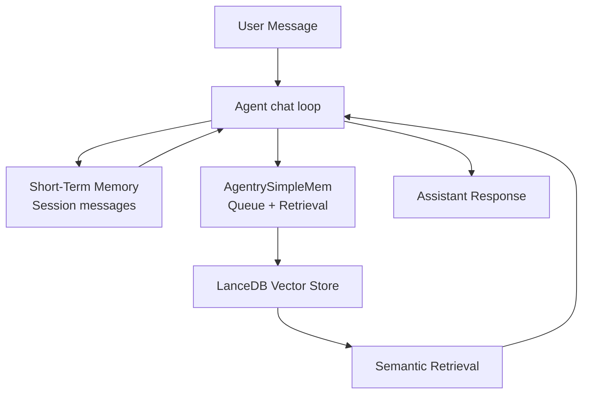

Logicore agents have two distinct memory layers that work together to give agents both immediate conversational continuity and durable recall across sessions.

<CardGroup cols={2}>
  <Card title="Short-Term Memory" icon="clock" href="./memory-short-term">
    Per-session conversation history stored in `AgentSession`. Tracks all messages, roles, and metadata for the active context window.
  </Card>
  <Card title="Long-Term Memory" icon="database" href="./memory-long-term">
    Persistent vector storage via `AgentrySimpleMem` and LanceDB. Survives process restarts and can be shared across sessions.
  </Card>
</CardGroup>

## Architecture

The two layers are independently managed but both feed the agent's LLM context at inference time:



## How the Two Layers Work Together

<Steps>
  <Step title="User message arrives">
    The agent receives the user message and appends it to the active `AgentSession` message list.
  </Step>
  <Step title="Long-term retrieval runs">
    If `memory=True`, `AgentrySimpleMem.on_user_message()` is called. It performs a fast embedding-based semantic search against the LanceDB table and returns relevant memory strings to inject into the LLM context.
  </Step>
  <Step title="LLM is called with full context">
    The LLM receives the full session message history (short-term) augmented with any retrieved memory snippets (long-term).
  </Step>
  <Step title="Response is queued for persistence">
    After the assistant responds, `AgentrySimpleMem.on_assistant_message()` queues the turn. When `process_pending()` is called (automatically at the end of each chat), high-signal facts are extracted, embedded, and written to LanceDB.
  </Step>
</Steps>

## Key Behaviors

<Note>
  Short-term memory is always available for any active session. Long-term memory requires `memory=True` on agent construction and a running Ollama embedding service.
</Note>

| Behavior | Short-Term | Long-Term |
|---|---|---|
| Scope | Single session | Configurable (per-session or per-user) |
| Persistence | In-process only | Survives restarts (LanceDB on disk) |
| Retrieval | Full history in order | Top-K semantic similarity |
| Filtering | None — all messages kept | Score-based; small talk is dropped |
| Enabled by default | Yes | No — requires `memory=True` |

## The `AgentrySimpleMem` Class

`AgentrySimpleMem` is the primary interface for long-term memory. It lives at `logicore.simplemem.AgentrySimpleMem` and is instantiated automatically by `Agent` when `memory=True`.

```python
from logicore.simplemem import AgentrySimpleMem

memory = AgentrySimpleMem(
    user_id="alice",
    session_id="project-alpha",
    max_context_entries=5,
    isolate_by_session=True,
    debug=True
)
```

You can interact with the instance directly, or let the agent manage it for you. See the [SimpleMem Integration](./memory-simplemem-integration) page for full constructor details.

## When to Use Each Type

<Tabs>
  <Tab title="Short-Term Only">
    Use short-term memory alone when:
    - The conversation is self-contained within a single session
    - You don't need recall across process restarts
    - You want the simplest possible setup

    ```python
    from logicore.agents.agent import Agent

    agent = Agent(llm="ollama")  # memory defaults to False
    await agent.chat("Hello", session_id="my-session")
    ```
  </Tab>
  <Tab title="With Long-Term Memory">
    Enable long-term memory when:
    - Users return across multiple sessions and expect recall
    - The agent needs to remember preferences, facts, or project context
    - You are building workflows where prior decisions matter

    ```python
    from logicore.agents.agent import Agent

    agent = Agent(llm="ollama", memory=True)
    await agent.chat("I work on the payments team", session_id="user-123")
    # In a later session:
    reply = await agent.chat("What team am I on?", session_id="user-123")
    ```
  </Tab>
</Tabs>

## Next Steps

<CardGroup cols={2}>
  <Card title="Short-Term Memory" icon="messages" href="./memory-short-term">
    Session history, `AgentSession`, context compression, and `SessionManager`.
  </Card>
  <Card title="Long-Term Memory" icon="brain" href="./memory-long-term">
    The LanceDB storage pipeline, scoring logic, and retrieval flow.
  </Card>
  <Card title="SimpleMem Integration" icon="plug" href="./memory-simplemem-integration">
    Full `AgentrySimpleMem` API reference and configuration options.
  </Card>
</CardGroup>
