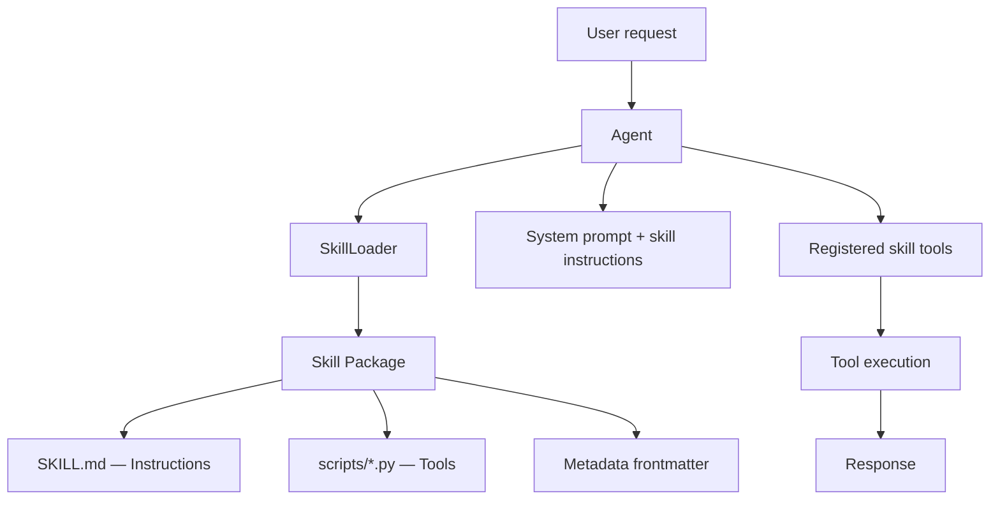
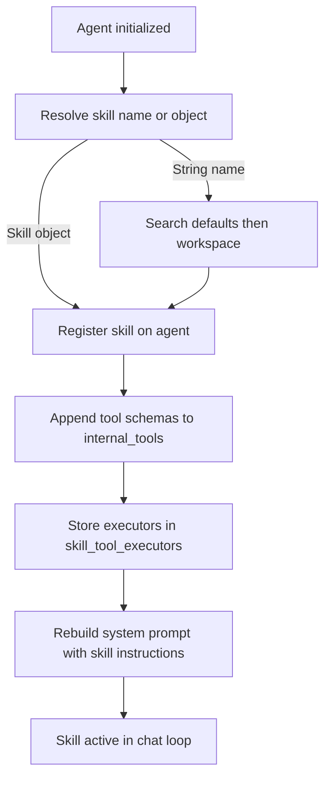

Skills give agents structured, domain-specific behavior without requiring you to wire prompts and tools together every time. Each skill is a directory-based package containing a `SKILL.md` instruction file, optional Python tool scripts, and metadata — all discovered and loaded automatically by `SkillLoader`.

## What a skill contains

Every skill is a directory with the following layout:

```text
my-skill/
├── SKILL.md          # Instructions + YAML frontmatter metadata
├── scripts/          # Python files exposing callable tool functions
├── resources/        # Templates, reference assets
└── examples/         # Reference implementations
```

Only `SKILL.md` is required. The `scripts/` directory is optional but necessary if the skill needs to register executable tools.

### The three layers of a skill

<Columns cols={3}>
  <Card title="Instructions" icon="file-text">
    Markdown content in `SKILL.md` that is injected into the agent's system prompt inside `<skills>` tags, guiding model behavior for this domain.
  </Card>
  <Card title="Tools" icon="wrench">
    Python functions in `scripts/*.py` with docstrings and type hints. `SkillLoader` imports them dynamically and registers their schemas and callables with the agent.
  </Card>
  <Card title="Metadata" icon="tag">
    YAML frontmatter in `SKILL.md` parsed into a `SkillMetadata` object: `name`, `description`, `version`, `author`, `tags`, and `requires`.
  </Card>
</Columns>

## Built-in skills

Logicore ships two default skills in `logicore/skills/defaults/`. They are available by name in any agent without any additional setup.

<Columns cols={2}>
  <Card title="web_research" icon="globe">
    Structured web research with multi-source verification. Guides the agent through query analysis, search, source cross-referencing, and synthesis with citations.

    **Tags:** `research`, `web`, `search`, `analysis`
  </Card>
  <Card title="code_review" icon="code">
    Automated code review covering bugs, security vulnerabilities, performance issues, and code quality. Outputs structured findings rated by severity.

    **Tags:** `code`, `review`, `security`, `quality`
  </Card>
</Columns>

## Skills vs. tools

| | Tools | Skills |
|---|---|---|
| **Unit** | Single callable function | Bundle of instructions + multiple tools |
| **Prompt impact** | None | Injects domain instructions into system prompt |
| **Discovery** | Registered manually | Auto-discovered from filesystem |
| **Reuse** | Per-agent wiring | Load by name across any agent |
| **Metadata** | None | `name`, `version`, `author`, `tags`, `requires` |

Skills *wrap* tools. When a skill is loaded, each function discovered in its `scripts/` directory is registered as a tool on the agent, alongside the skill's instructions.

## Architecture



## Loading flow

When an agent loads a skill, the following sequence runs:



## Quick start

```python
from logicore.agents.agent import Agent

agent = Agent(
    llm="ollama",
    tools=True,
    skills=["web_research"]
)

response = await agent.chat("Find and summarize recent updates on AI safety")
print(response)
```

<Tip>
  Use small, focused skills per domain capability. A skill named `web_research` that does one thing well is easier to maintain and combine than a broad skill trying to cover many domains.
</Tip>

## Why skills matter

- **Consistency** — the same instructions and tool bundle are reused across projects and team members, eliminating prompt drift.
- **Faster setup** — load a named skill instead of wiring tools and prompts individually every time.
- **Better quality** — domain-specific guidance in `SKILL.md` helps the model follow the correct workflow for a given task.
- **Governance** — `SkillMetadata` fields (`name`, `version`, `author`, `tags`, `requires`) make capabilities auditable and versioned.
- **Composability** — multiple focused skills can be combined on a single agent for well-rounded capability.

## Next steps

<Columns cols={2}>
  <Card title="Use skills in agents" icon="play" href="/concepts/skills/skills-use-in-agents">
    Load built-in and custom skills at agent creation or dynamically at runtime.
  </Card>
  <Card title="Build custom skills" icon="hammer" href="/concepts/skills/skills-build-custom">
    Create your own SKILL.md package with custom tool functions and register it in your workspace.
  </Card>
</Columns>
